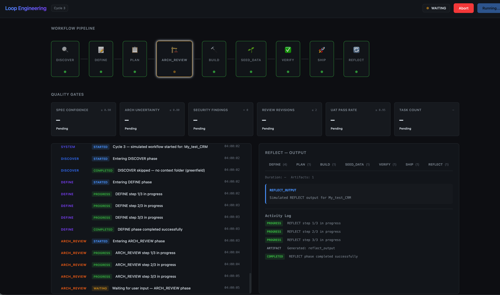

# Loop Engineering



Self-improving AI-driven software development engine built on LangGraph.

```
DISCOVER → DEFINE → PLAN → ARCH_REVIEW → BUILD → SEED_DATA → VERIFY → SHIP → REFLECT
```

Each cycle runs through these phases with quality gates, HIL (Human-in-the-Loop) review gates, and self-improvement via ChromaDB pattern storage. CLI and Web UI share the same `WorkflowRunner` — identical node execution, different UX layers.

## Architecture

<div class="arch-diagram" style="background:#f8f9fa;border:2px solid #dee2e6;border-radius:12px;padding:24px;margin:24px 0;font-family:system-ui,-apple-system,sans-serif">
  <style scoped>
    .arch-diagram h2,.arch-diagram h3,.arch-diagram h4{margin:0 0 8px 0}
    .arch-diagram h2{text-align:center;font-size:1.5em}
    .arch-diagram h3{text-align:center;font-size:1.2em;margin-top:24px}
    .arch-diagram h4{font-size:1em;margin-bottom:12px}
    .arch-pipeline{display:flex;flex-wrap:wrap;justify-content:center;align-items:center;gap:8px;margin:20px 0}
    .arch-phase{padding:8px 16px;border-radius:20px;font-weight:bold;font-size:0.9em;border:2px solid}
    .arch-phase.phase{background:#e8f5e9;border-color:#4CAF50;color:#1b5e20}
    .arch-phase.hil{background:#fff3e0;border-color:#FF9800;color:#e65100}
    .arch-arrow{color:#666;font-size:1.2em}
    .arch-grid{display:grid;grid-template-columns:repeat(auto-fit,minmax(280px,1fr));gap:16px;margin:20px 0}
    .arch-section{background:white;border-radius:10px;padding:16px;border-left:4px solid;box-shadow:0 2px 4px rgba(0,0,0,0.1)}
    .arch-node{background:#f8f9fa;border:1px solid #dee2e6;border-radius:6px;padding:10px;margin:6px 0;font-size:0.9em}
    .arch-node h4{margin:0 0 4px 0;color:#1a1a2e;font-size:0.95em}
    .arch-node p{margin:0;color:#666;font-size:0.85em}
    .arch-connections{display:grid;grid-template-columns:repeat(auto-fit,minmax(250px,1fr));gap:16px;margin:20px 0}
    .arch-connection{background:white;border:1px solid #dee2e6;border-radius:8px;padding:14px}
    .arch-connection h4{margin:0 0 10px 0;color:#1a1a2e;font-size:1em}
    .arch-connection ul{list-style:none;padding:0;margin:0}
    .arch-connection li{padding:4px 0;font-size:0.85em;color:#666;border-bottom:1px solid #f8f9fa}
    .arch-connection li:last-child{border-bottom:none}
    .arch-legend{display:flex;flex-wrap:wrap;gap:10px;margin-top:20px}
    .arch-legend-item{display:flex;align-items:center;gap:5px;font-size:0.8em;color:#666}
    .arch-color{width:16px;height:16px;border-radius:3px;border:2px solid}
    .arch-decision{text-align:center;margin:12px 0}
    .arch-decision span{display:inline-block;padding:6px 14px;border-radius:20px;font-size:0.85em;margin:0 8px;font-weight:600}
    .arch-decision .approved{background:#e8f5e9;border:2px solid #4CAF50;color:#1b5e20}
    .arch-decision .rejected{background:#ffebee;border:2px solid #F44336;color:#b71c1c}
  </style>

  <h2>🔄 Loop Engineering Architecture</h2>
  <p style="text-align:center;color:#666">Self-improving AI-driven software development engine built on LangGraph with Human-in-the-Loop capabilities</p>

  <h3>📊 Pipeline Flow</h3>
  <div class="arch-pipeline">
    <div class="arch-phase phase">DISCOVER</div><div class="arch-arrow">→</div>
    <div class="arch-phase phase">DEFINE</div><div class="arch-arrow">→</div>
    <div class="arch-phase phase">PLAN</div><div class="arch-arrow">→</div>
    <div class="arch-phase hil">ARCH_REVIEW</div><div class="arch-arrow">→</div>
    <div class="arch-phase phase">BUILD</div><div class="arch-arrow">→</div>
    <div class="arch-phase phase">SEED_DATA</div><div class="arch-arrow">→</div>
    <div class="arch-phase phase">VERIFY</div><div class="arch-arrow">→</div>
    <div class="arch-phase phase">SHIP</div><div class="arch-arrow">→</div>
    <div class="arch-phase phase">REFLECT</div>
  </div>
  <div class="arch-decision">
    <span class="approved">✅ Approved → Next Phase</span>
    <span class="rejected">❌ Rejected → Loop Back</span>
  </div>

  <h3>📦 Component Architecture</h3>
  <div class="arch-grid">
    <div class="arch-section" style="border-left-color:#4CAF50">
      <h4>📥 CLI &amp; API Layer</h4>
      <div class="arch-node"><h4>main.py</h4><p>CLI entry — delegates to WorkflowRunner</p></div>
      <div class="arch-node"><h4>api/app.py</h4><p>FastAPI application entry point</p></div>
      <div class="arch-node"><h4>api/routes.py</h4><p>REST endpoints for workflow start/status</p></div>
      <div class="arch-node"><h4>api/services.py</h4><p>WorkflowService — orchestrates graph execution</p></div>
      <div class="arch-node"><h4>api/input_manager.py</h4><p>Manages user input for HIL gates</p></div>
    </div>

    <div class="arch-section" style="border-left-color:#2196F3">
      <h4>🔄 LangGraph Engine</h4>
      <div class="arch-node"><h4>graph/main.py</h4><p>StateGraph construction + interrupt_after</p></div>
      <div class="arch-node"><h4>graph/executor.py</h4><p>WorkflowRunner — shared CLI/Web UI executor</p></div>
      <div class="arch-node"><h4>graph/state.py</h4><p>WorkflowState + CycleMetrics</p></div>
      <div class="arch-node"><h4>graph/edges.py</h4><p>Conditional routing + quality gates</p></div>
      <div class="arch-node"><h4>graph/sqlite_saver.py</h4><p>Checkpoint persistence (SQLite)</p></div>
    </div>

    <div class="arch-section" style="border-left-color:#9C27B0">
      <h4>📋 Phase Nodes</h4>
      <div class="arch-node"><h4>discover.py</h4><p>HIL interview + codebase scan</p></div>
      <div class="arch-node"><h4>define.py</h4><p>Spec + API contract generation</p></div>
      <div class="arch-node"><h4>plan.py</h4><p>Architecture plan + task list</p></div>
      <div class="arch-node"><h4>arch_review.py</h4><p>HIL gate — spec/plan review</p></div>
      <div class="arch-node"><h4>build.py</h4><p>Code generation + TDD + security</p></div>
      <div class="arch-node"><h4>seed_data.py</h4><p>Test data fixtures</p></div>
      <div class="arch-node"><h4>verify.py</h4><p>UAT + performance + debugging</p></div>
      <div class="arch-node"><h4>ship.py</h4><p>Deploy + observability + git tag</p></div>
      <div class="arch-node"><h4>reflect.py</h4><p>Cycle analysis + ChromaDB patterns</p></div>
    </div>

    <div class="arch-section" style="border-left-color:#FF9800">
      <h4>🛠 Tools &amp; Skills</h4>
      <div class="arch-node"><h4>tools/loader.py</h4><p>Skill registry — ~27 SKILL.md files</p></div>
      <div class="arch-node"><h4>tools/llm.py</h4><p>LLM invocation + skill injection</p></div>
      <div class="arch-node"><h4>tools/context_manager.py</h4><p>LLM context window optimization</p></div>
      <div class="arch-node"><h4>tools/audit_logger.py</h4><p>Audit trail for LLM calls</p></div>
      <div class="arch-node"><h4>tools/distiller.py</h4><p>Response distillation</p></div>
    </div>

    <div class="arch-section" style="border-left-color:#F44336">
      <h4>👤 HIL Frontend</h4>
      <div class="arch-node"><h4>frontend/backend/app.py</h4><p>FastAPI frontend entry</p></div>
      <div class="arch-node"><h4>frontend/backend/workflow_bridge.py</h4><p>SSE events + LangGraph resume</p></div>
      <div class="arch-node"><h4>frontend/backend/abort_manager.py</h4><p>Workflow abort + checkpoint cleanup</p></div>
      <div class="arch-node"><h4>frontend/static/js/app.js</h4><p>SSE client + Mermaid rendering</p></div>
      <div class="arch-node"><h4>frontend/static/css/style.css</h4><p>Frontend styling</p></div>
    </div>

    <div class="arch-section" style="border-left-color:#795548">
      <h4>📊 Feedback Loop</h4>
      <div class="arch-node"><h4>feedback/aggregator.py</h4><p>Cycle recording + metrics</p></div>
      <div class="arch-node"><h4>feedback/chroma_client.py</h4><p>Pattern embeddings + similarity search</p></div>
      <div class="arch-node"><h4>feedback/diff_engine.py</h4><p>Config diff generation</p></div>
    </div>

    <div class="arch-section" style="border-left-color:#00BCD4">
      <h4>⚙️ Configuration</h4>
      <div class="arch-node"><h4>config/config.yaml</h4><p>Three-tier config (env &gt; YAML &gt; defaults)</p></div>
      <div class="arch-node"><h4>config/loader.py</h4><p>Config resolution logic</p></div>
      <div class="arch-node"><h4>config/guardrails.yaml</h4><p>Quality thresholds + LLM settings</p></div>
      <div class="arch-node"><h4>config/guardrails.py</h4><p>Runtime threshold enforcement</p></div>
      <div class="arch-node"><h4>config/prompt_templates.py</h4><p>Phase-specific LLM prompts</p></div>
    </div>

    <div class="arch-section" style="border-left-color:#607D8B">
      <h4>🔧 Services</h4>
      <div class="arch-node"><h4>service/health.py</h4><p>Health check server</p></div>
      <div class="arch-node"><h4>service/otel_instrumentor.py</h4><p>OpenTelemetry traces</p></div>
      <div class="arch-node"><h4>log/logging.py</h4><p>Structured logging</p></div>
    </div>
  </div>

  <h3>🔗 Data Flow</h3>
  <div class="arch-connections">
    <div class="arch-connection">
      <h4>🔄 Workflow Execution</h4>
      <ul>
        <li>CLI → api/services → graph/executor</li>
        <li>api/routes → WorkflowService</li>
        <li>graph/main → nodes/*.py</li>
        <li>nodes → tools/llm → LLM endpoint</li>
      </ul>
    </div>
    <div class="arch-connection">
      <h4>👥 HIL Bridge</h4>
      <ul>
        <li>DISCOVER → interrupt() → SSE → frontend</li>
        <li>ARCH_REVIEW → interrupt_after → SSE → frontend</li>
        <li>frontend → workflow_bridge → resume()</li>
        <li>frontend → abort_manager → cancel()</li>
      </ul>
    </div>
    <div class="arch-connection">
      <h4>📊 Feedback Loop</h4>
      <ul>
        <li>REFLECT → feedback/aggregator</li>
        <li>aggregator → chroma_client → ChromaDB</li>
        <li>aggregator → diff_engine → git-workflow</li>
      </ul>
    </div>
    <div class="arch-connection">
      <h4>🎯 Quality Gates</h4>
      <ul>
        <li>ARCH_REVIEW: approved → BUILD</li>
        <li>ARCH_REVIEW: rejected → DEFINE</li>
        <li>BUILD: pass → SEED_DATA / fail → PLAN</li>
        <li>VERIFY: pass → SHIP / fail → BUILD</li>
      </ul>
    </div>
    <div class="arch-connection">
      <h4>🛠 Skills Wiring</h4>
      <ul>
        <li>tools/loader → skills/ (27 SKILL.md)</li>
        <li>DISCOVER → interview-me</li>
        <li>DEFINE → speckit-specify → api-and-interface-design</li>
        <li>BUILD → incremental-implementation → tdd → security → code-review</li>
      </ul>
    </div>
    <div class="arch-connection">
      <h4>🔧 Observability</h4>
      <ul>
        <li>service/otel_instrumentor → OpenTelemetry</li>
        <li>log/logging → structured logs</li>
        <li>tools/audit_logger → LLM audit trail</li>
      </ul>
    </div>
  </div>

  <div class="arch-legend">
    <div class="arch-legend-item"><div class="arch-color" style="background:#e8f5e9;border-color:#4CAF50"></div>CLI &amp; API</div>
    <div class="arch-legend-item"><div class="arch-color" style="background:#e3f2fd;border-color:#2196F3"></div>LangGraph</div>
    <div class="arch-legend-item"><div class="arch-color" style="background:#f3e5f5;border-color:#9C27B0"></div>Phase Nodes</div>
    <div class="arch-legend-item"><div class="arch-color" style="background:#fff3e0;border-color:#FF9800"></div>Tools &amp; Skills</div>
    <div class="arch-legend-item"><div class="arch-color" style="background:#ffebee;border-color:#F44336"></div>HIL Frontend</div>
    <div class="arch-legend-item"><div class="arch-color" style="background:#fbe9e7;border-color:#795548"></div>Feedback</div>
    <div class="arch-legend-item"><div class="arch-color" style="background:#e0f7fa;border-color:#00BCD4"></div>Configuration</div>
    <div class="arch-legend-item"><div class="arch-color" style="background:#eceff1;border-color:#607D8B"></div>Services</div>
  </div>
</div>

### Key Components

- **Entry Points**: CLI (`main.py`) for headless auto-approve, or Web UI (FastAPI `:8011`) for HIL workflow
- **LangGraph Engine**: `StateGraph` with 10 phase nodes, conditional routing via quality gates, OOTB `interrupt_after` for HIL pauses
- **Skills System**: 27 `SKILL.md` files loaded by `tools/loader.py`, invoked via `tools/llm.py` with context optimization
- **HIL Bridge**: SSE event streaming between LangGraph executor and frontend; supports double-pause DISCOVER interview and ARCH_REVIEW diagram approval
- **Feedback Loop**: ChromaDB stores historical patterns across cycles; REFLECT phase queries and generates config diff proposals
- **Deployment**: Single Docker Compose stack (`loop` container = orchestrator + frontend + nginx)

## Quick Start

### Prerequisites

- **Docker** + **Docker Compose**
- **LLM endpoint** (OpenAI-compatible, e.g., vLLM on `http://localhost:8080/v1`)

### Option A: CLI (headless, auto-approve)

```bash
docker compose up -d --build
```

Runs the orchestrator in auto-approve mode. DISCOVER generates default interview notes from the spec.

### Option B: Web UI (HIL)

```bash
docker compose up -d --build loop
```

Open `http://localhost:8011`. Progress streams via Server-Sent Events (SSE) with quality gates dashboard, phase details, and Mermaid diagram rendering at ARCH_REVIEW gates.

### LLM Configuration

```bash
# Local vLLM
export LLM_BASE_URL="http://localhost:8080/v1"
export LLM_MODEL="qwen3.6-27b"

# OpenAI
export LLM_BASE_URL="https://api.openai.com/v1"
export LLM_MODEL="gpt-4o"
export OPENAI_API_KEY="sk-..."
```

> ⚠️ **Token Usage**: A full cycle makes 20–35 LLM calls. Monitor your provider's usage dashboard during long runs.

## How It Works

### Pipeline Phases

1. **DISCOVER** — HIL interview node using LangGraph OOTB `interrupt()`. Double-pause: first for project setup (name + description), then for interview questions (9 structured questions). Scans existing codebases for context. Generates `requirement.md`. In Web UI mode, pauses for user input via SSE. In auto-approve mode, generates defaults.

2. **DEFINE** — Generates a structured specification via `speckit-specify`, then produces an API contract via `api-and-interface-design`. Fully automatic — interview data collected in DISCOVER. Incorporates user review feedback if returning from ARCH_REVIEW rejection.

3. **PLAN** — Architecture and task planning: `writing-plans` → `speckit-tasks` → `speckit-analyze` → `doubt-driven-development` → `speckit-checklist`. Generates architecture diagrams via `architecture-diagram-generator`. Diagrams are stored as `plan.md` and `diagrams.md` in the project output folder.

4. **ARCH_REVIEW** — HIL gate: pauses execution so the user can review the specification, plan, and architecture diagrams before BUILD begins. Web UI renders Mermaid diagrams client-side with tabbed diagram viewer. User can approve (proceeds to BUILD) or reject with feedback (loops back to DEFINE). Max 2 retries before forced progression.

5. **BUILD** — Iterative code generation per task item: `incremental-implementation` → `test-driven-development` (per item). Final aggregate passes: `security-and-hardening` (STRIDE model) → `requesting-code-review`. Runs Docker Compose build, health check, and pytest. Max 2 retries per cycle.

6. **SEED_DATA** — Test data and fixture generation via `ai-workflow-data-seeding`. Executes seed script inside the running Docker container.

7. **VERIFY** — Comprehensive validation: `uat-workflow` (Playwright) mandatory. Conditional passes: `performance-optimization` (if P95 latency > 500 ms) → `systematic-debugging` (if flakiness > 10%) → `code-simplification` (if review revisions exceed threshold).

8. **SHIP** — Deployment packaging: `observability-and-instrumentation` → `shipping-and-launch` → `docker-compose-deployment` (if BUILD did not deploy) → `git-workflow` (version tag).

9. **REFLECT** — Cycle analysis: aggregates metrics and feedback, queries ChromaDB for historical patterns, meta-agent generates proposed config/guardrail diffs, dry-run validation, human approval gate for changes. Approved changes committed via `git-workflow`.

### Skills System

Each node chains skills from `skills/` (27 currently registered). A skill is skipped if missing — the pipeline continues with whatever artifacts were produced.

| Phase | Skills Chained |
|---|---|
| DISCOVER | `interview-me` → Fabric Prompt Engineering → codebase scan (filesystem/git/docker) |
| DEFINE | `speckit-specify` → `api-and-interface-design` |
| PLAN | `writing-plans` → `speckit-tasks` → `speckit-analyze` → `doubt-driven-development` → `speckit-checklist` → `architecture-diagram-generator` |
| ARCH_REVIEW | HIL gate (human reviews spec + plan + Mermaid diagrams — no skills called) |
| BUILD | `incremental-implementation` → `test-driven-development` (per task item) → `security-and-hardening` → `requesting-code-review` (aggregate) |
| SEED_DATA | `ai-workflow-data-seeding` |
| VERIFY | `uat-workflow` (mandatory) → `performance-optimization` (if slow) → `systematic-debugging` (if flaky) → `code-simplification` (if high revision count) |
| SHIP | `observability-and-instrumentation` → `shipping-and-launch` → `docker-compose-deployment` → `git-workflow` |
| REFLECT | Internal `diff_engine` + meta-agent → `git-workflow` (commit approved diffs) |

**Total per cycle**: ~20–35 LLM calls. BUILD loops (up to 2 retries) can increase this.

### Quality Gates

Thresholds from `config/guardrails.yaml`:

| Phase | Gate |
|---|---|
| DISCOVER | HIL required in Web UI mode; auto-generates defaults in auto-approve mode |
| DEFINE | `spec_confidence ≥ 0.9` or loop back |
| PLAN | `arch_uncertainty ≤ 0.8` or loop back |
| BUILD | `security_findings = 0`, `review_revisions ≤ 2`, Docker build + health check + pytest pass — or loop back |
| SEED_DATA | `seed_errors` is empty or loop back to BUILD |
| VERIFY | `uat_pass_rate ≥ 0.95` or loop back to BUILD |
| REFLECT | Human approval required for config changes (auto-apply low-risk when confidence ≥ 0.95) |

### Self-Improvement Loop

After SHIP, REFLECT:
1. Aggregates cycle metrics and feedback
2. Queries ChromaDB for historical patterns
3. Meta-agent generates proposed skill/config/guardrail diffs
4. Dry-run validation against guardrails
5. Human approval gate (Web UI)
6. Approved changes committed via `git-workflow`

Low-risk changes (confidence ≥ 0.95, zero security findings) can auto-apply.

## Project Structure

```
loop_engineering/
├── main.py                    # CLI entry (delegates input to DISCOVER)
├── config/
│   ├── config.yaml           # Three-tier config (env > YAML > defaults)
│   ├── loader.py            # Config resolution
│   ├── guardrails.yaml       # Quality thresholds, LLM settings, security rules
│   ├── guardrails.py         # Runtime threshold loader
│   └── prompt_templates.py   # LLM prompt templates for each phase
├── graph/
│   ├── main.py               # LangGraph construction (node wiring, interrupt_after)
│   ├── executor.py          # Shared WorkflowRunner (CLI + Web UI)
│   ├── state.py             # WorkflowState + CycleMetrics
│   ├── edges.py             # Conditional routing with quality gates
│   └── nodes/               # Phase implementations
│       ├── discover.py      # HIL interview + codebase scan + requirement generation
│       ├── define.py        # Spec + API contract generation
│       ├── plan.py          # Architecture plan + tasks
│       ├── architecture.py  # Architecture diagram generation (Mermaid)
│       ├── arch_review.py   # HIL gate (diagram review via Web UI)
│       ├── build.py         # Incremental code generation + test + security
│       ├── seed_data.py     # Test data seeding via Docker
│       ├── verify.py        # UAT, perf, debugging, simplification
│       ├── ship.py          # Observability, launch, deploy, git tag
│       ├── reflect.py       # Cycle analysis + ChromaDB + config diffs
│       └── review_contract.py  # Shared HIL review contract (CLI & Web UI parity)
├── feedback/
│   ├── aggregator.py        # Cycle recording, ChromaDB queries
│   ├── chroma_client.py     # Pattern embeddings, similarity search
│   └── diff_engine.py       # Config diff generation
├── tools/
│   ├── llm.py               # LLM invocation with skill injection
│   └── loader.py           # Skill registry builder
├── skills/                   # 27 SKILL.md files (one per skill)
├── frontend/                 # Web UI (FastAPI + nginx)
│   ├── backend/            # FastAPI app, SSE streaming, workflow bridge
│   │   ├── app.py          # FastAPI entry point
│   │   ├── workflow_bridge.py  # LangGraph execution bridge + event emission
│   │   └── abort_manager.py    # Workflow abort/cleanup
│   ├── static/             # HTML/CSS/JS frontend (Mermaid.js for diagrams)
│   └── nginx/              # nginx configuration
├── observability/           # OpenTelemetry collector config + Promtail
│   └── otel-collector-config.yaml
├── output/                   # Phase artifacts (./output/<project_name>/)
├── storage/                 # Persistent cycle data (live.json, cycles/)
├── specs/                   # Example specs from the workflow
├── scripts/
│   └── uat_pipeline.sh     # UAT pipeline helper
├── docker-compose.yml       # Stack: orchestrator + ChromaDB + OTEL + Phoenix
├── Dockerfile               # Container image (Python + nginx)
└── requirements.txt        # Python dependencies
```

## Configuration

Three-tier priority: **Environment Variables** > **`config/config.yaml`** > **Built-in Defaults**.

Key settings in `config.yaml`:
```yaml
paths:
  project_name: test_discover_fix
  workspace_dir: ~/workspace/projects
  project_path: '{{project_name}}'
  skills_dir: skills
  storage_dir: ./storage
  guardrails_path: ./config/guardrails.yaml

workflow:
  hil_mode: auto
  max_retries: 2
  auto_approve: false
```

LLM settings in `config/guardrails.yaml`:
```yaml
llm:
  model: Qwen3.6-27B
  base_url: ${LLM_BASE_URL:-http://localhost:8080/v1}
  temperature: 0.1
  max_retries: 3
```

## Dependencies

```
langgraph, langchain-core, langgraph-checkpoint, langgraph-sdk
pydantic, pyyaml, httpx, aiohttp
chromadb (pattern storage)
opentelemetry-api, opentelemetry-sdk (observability)
```

Install: baked into Docker image via `docker compose up -d --build`.

## Guardrails

Security-sensitive keywords (`auth`, `payment`, `billing`, `credential`, `secret`, `api_key`, `token`, etc.) trigger human approval. See `config/guardrails.yaml` for full thresholds and feedback rules.

Quality thresholds enforced per phase:

| Threshold | Default | Phase |
|---|---|---|
| `min_spec_confidence` | ≥ 0.9 | DEFINE |
| `max_arch_uncertainty` | ≤ 0.8 | PLAN |
| `max_security_findings` | 0 | BUILD |
| `max_review_revisions` | ≤ 2 | BUILD |
| `min_uat_pass_rate` | ≥ 0.95 | VERIFY |
| `max_latency_ms` | ≤ 500 | VERIFY (perf) |
| `max_test_flakiness_rate` | ≤ 0.1 | VERIFY (debug) |
